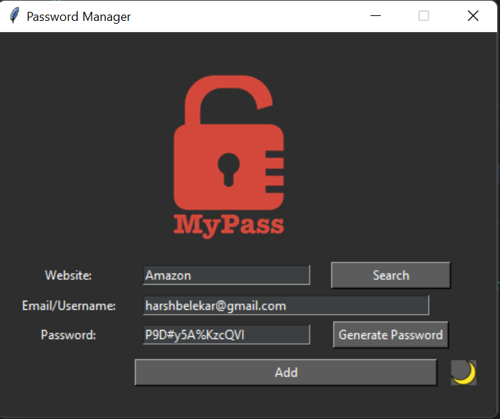
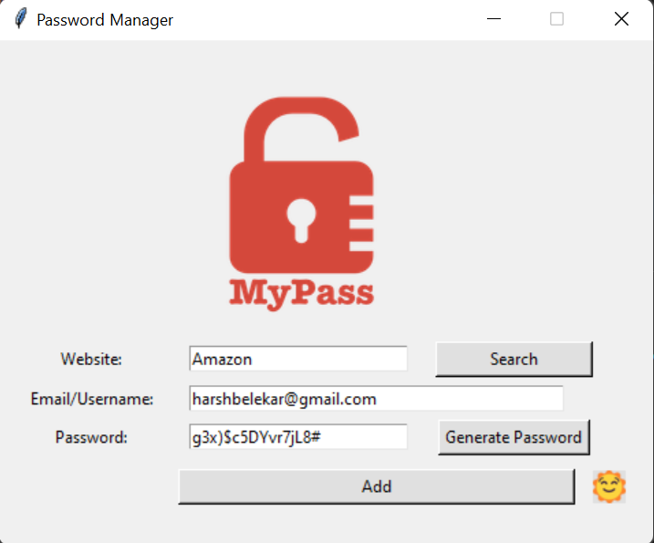

# 🔐 Password Manager App

A sleek and secure desktop application to manage your passwords — with encryption, dark/light mode toggle, clipboard support, and more. Built using Python and Tkinter.

---

# ✨ Features

- 🌙 **Dark Mode & Light Mode** toggle with icon-based switch (🌞 / 🌚)
- 🔐 **AES Encryption** using `cryptography` to securely store passwords
- 🎲 **Strong Password Generator** (letters, symbols, numbers)
- 🔎 **Search Functionality** to retrieve saved credentials by website
- 💾 **Local JSON Storage** (encrypted)
- 📋 **Clipboard Copy** for generated passwords
- 🖼️ Polished **Tkinter GUI** with custom icons and colors

---

## 📸 Screenshots

| Dark Mode                        | Light Mode                         |
|----------------------------------|------------------------------------|
|  |  |

---

## 🗂️ Folder Structure

    password_manager/
    ├── main.py # Main GUI and app logic
    ├── core/
    │ ├── password_logic.py # PasswordGenerator class
    │ └── crypto_util.py # Encryptor class for encryption/decryption
    ├── assets/
    │ ├── logo.png # App logo
    │ ├── sun.png # Light mode icon
    │ ├── moon.png # Dark mode icon
    │ ├── password_data.json # Encrypted password storage (ignored by git)
    │ └── secret.key # Encryption key (ignored by git)
    ├── requirements.txt # Python dependencies
    ├── README.md # You're reading it!
    └── .gitignore # Prevents sensitive files from being tracked

---

# 🚀 Getting Started

### 1. Clone the repository
    git clone https://github.com/YOUR_USERNAME/password-manager.git
    cd password-manager

### 2. Install dependencies
    pip install -r requirements.txt

### 3. Run the app
    python main.py

---

# 🛠 Technologies Used

 -  **tkinter** — GUI framework
 -  **pyperclip** — Clipboard integration
 -  **cryptography** — AES encryption for password security
 -  **json** — Data storage format

---

# 🧪 Build Executable (Windows)

 - Use PyInstaller to convert the app into a standalone executable:
    pyinstaller --onefile --windowed --icon=assets/logo.ico main.py

👉 The .exe file will be located in the dist/ folder after the build.

---

# 🛡️ Security Notes

 - Passwords are encrypted using a secure Fernet key, stored in assets/secret.key.

 - Both password_data.json and secret.key are excluded from Git using .gitignore for security reasons.

---